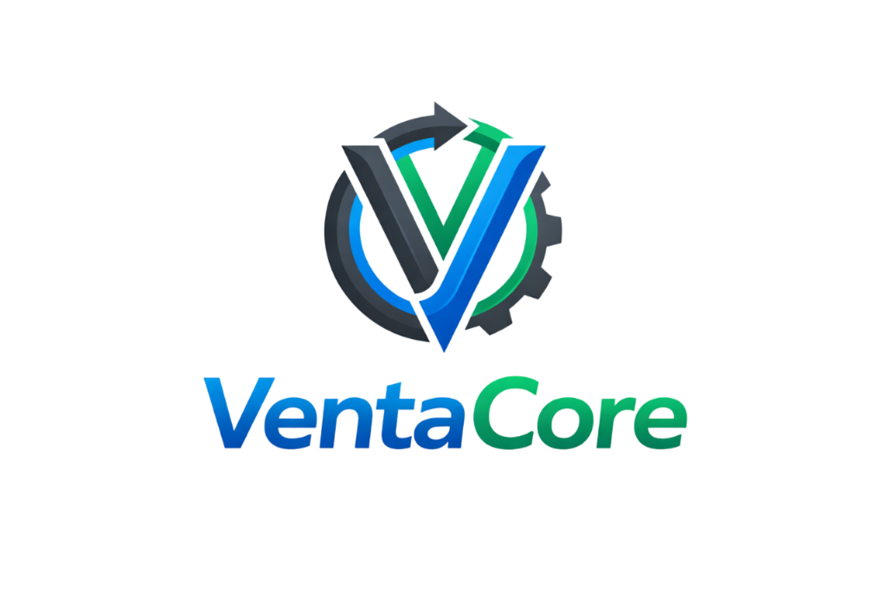

# 📦 VentaCore - Sistema Integral de Gestión y Ventas



**Software profesional de punto de venta (POS) e inventario 100% offline para Windows.**

---

## 🎯 Módulos Principales

### 🛒 Punto de Venta (POS)
- **Ventas Rápidas**: Interfaz ágil para búsqueda por nombre o código de barras.
- **Múltiples Métodos de Pago**: Efectivo (ARS/USD), Transferencia, QR, Débito y Crédito.
- **Gestión de Recargos**: Configuración personalizada de intereses por método de pago.
- **Tickets Profesionales**: Generación de tickets de venta con logo y mensajes personalizados (PDF/Impresión).

### 📦 Gestión de Inventario
- **Control Total**: Categorización de productos, precios de costo y venta.
- **Control de Stock**: Alertas visuales y analíticas de niveles de stock.
- **Códigos de Barras**: Generación individual y **impresión masiva por lote** (etiquetas de 60mm x 40mm).

### 👥 Clientes y Cuenta Corriente (Fiado)
- **Base de Datos de Clientes**: Registro completo de datos de contacto.
- **Cuenta Corriente**: Seguimiento detallado de deudas, entregas de dinero y movimientos históricos.
- **Saldos en Tiempo Real**: Visualización inmediata de la deuda total de cada cliente.

### 📝 Notas y Recordatorios
- **Tablero Kanban**: Gestión de notas con colores y estados.
- **Recordatorios Inteligentes**: Configuración de alarmas con **notificaciones de escritorio** automáticas al llegar la fecha programada.

### 💰 Caja y Finanzas
- **Control de Caja Diaria**: Entradas y salidas manuales de dinero.
- **Gastos y Compras**: Registro de compras a proveedores y gastos fijos del local.
- **Reportes Mensuales**: Análisis financiero detallado con Ingresos, Gastos y Ganancia Neta.

### 📑 Presupuestos
- **Creación de Cotizaciones**: Generación de presupuestos formales para clientes.
- **Conversión Directa**: Convierte un presupuesto en una venta real con un solo clic, descontando stock automáticamente.

---

## ✨ Características Destacadas

- 📶 **100% Offline**: Privacidad total y funcionamiento sin internet.
- 🚀 **Inicio con Windows**: Opción de inicio automático al encender el sistema.
- 📂 **Copia de Seguridad Automática**: Respaldo automático de toda la base de datos al cerrar el programa en la carpeta que elijas (Dropbox, Drive, etc.).
- 🚦 **Sistema de Alertas**: Notificaciones persistentes para stock bajo y tareas pendientes.
- 🔐 **Control de Accesos**: Roles diferenciados para **Admin** (acceso total) y **Vendedor** (solo POS y gestión operativa).

---

## 📚 Documentación Incluida

### Gestión de Proyecto
- Acta de Constitución  
- Plan de Proyecto  
- Registro de Interesados  
- Registro de Riesgos  
- Lecciones Aprendidas  

### Requerimientos
- Documento SRS  
- Historias de Usuario / Casos de Uso  
- Diagramas UML / Flujos  
- Modelo de Datos (ERD)

### Diseño de Software
- Arquitectura (SAD)  
- Diseño UI/UX  

### Manuales Técnicos
- Instalación  
- Configuración  

---

## 🛠️ Stack Tecnológico

- **Frontend**: React 19 + TailwindCSS 3
- **Backend/Desktop**: Electron 39
- **Base de Datos**: SQLite (Better-SQLite3)
- **Reportes/Excel**: XLSX (SheetJS)
- **Código de Barras**: JsBarcode

---

## 🚀 Instalación y Desarrollo

```bash
# Instalar dependencias
npm install

# Iniciar en modo desarrollo
npm run dev

# Generar instalador para Windows (.exe)
npm run dist
```

---

## 📊 Configuración de Alertas

| Estado | Condición |
|-------|-------|
| 🟢 **Disponible** | Stock > 10 |
| 🟡 **Poco Stock** | Stock entre 1 y 10 |
| 🔴 **Sin Stock** | Stock = 0 |
| ⚠️ **Alerta Global** | Notificación en Dashboard si hay más de 5 items bajos |

---

**VentaCore: Potenciando tu negocio con simplicidad y control.**
