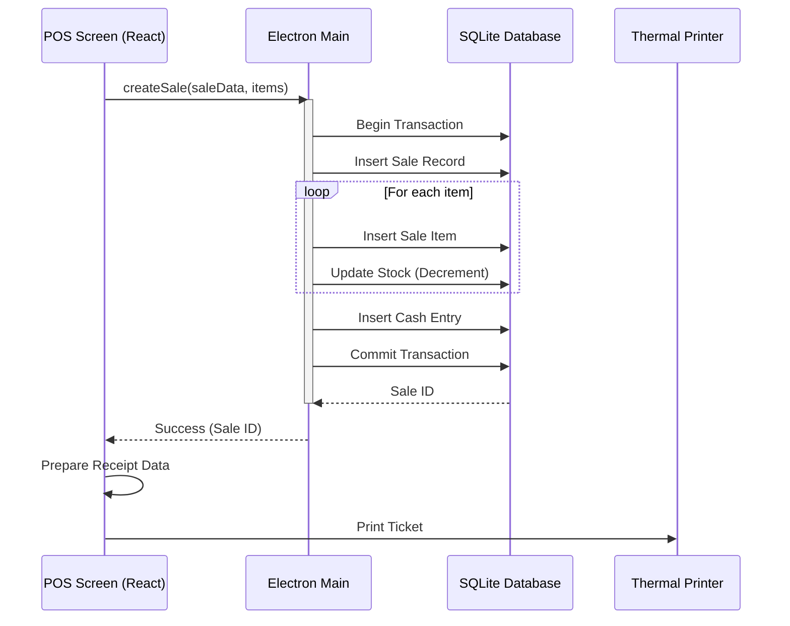

# Diagramas UML y Flujos de Proceso - ElectroStock

**Versión:** 1.0
**Fecha:** 8 de Diciembre de 2025

## 1. Diagrama de Actividad: Proceso de Venta (POS)

```mermaid
graph TD
    A[Inicio] --> B{¿Está Logueado?}
    B -- No --> C[Mostrar Login]
    B -- Si --> D[Pantalla POS]
    D --> E[Escanear Producto]
    E --> F{¿Producto Existe?}
    F -- No --> G[Mostrar Error] --> E
    F -- Si --> H[Agregar al Carrito]
    H --> I{¿Más Productos?}
    I -- Si --> E
    I -- No --> J[Seleccionar Medio de Pago]
    J --> K[Seleccionar Cliente (Opcional)]
    K --> L[Calcular Total + Recargos]
    L --> M[Confirmar Venta]
    M --> N[Actualizar Stock DB]
    N --> O[Registrar Venta DB]
    O --> P[Imprimir Ticket]
    P --> Q[Fin]
```

## 2. Diagrama de Secuencia: Confirmación de Venta



## 3. Diagrama BPMN: Cierre Mensual (Simplificado)

```mermaid
graph LR
    start((Inicio)) --> A[Revisar Ventas Mes]
    A --> B[Calcular Costos Totales]
    B --> C[Calcular Ganancia Neta]
    C --> D[Generar Reporte PDF]
    D --> E[Archivar]
    E --> end((Fin))
```
