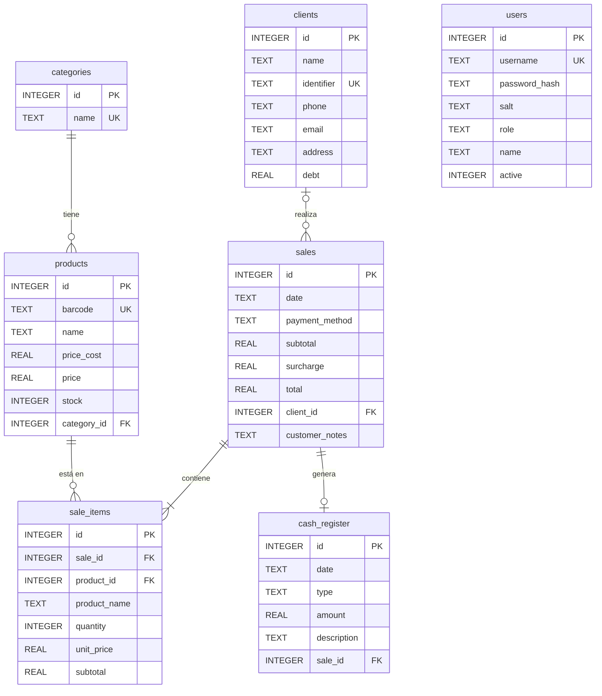

# Modelo de Datos (ERD) - ElectroStock

**Versión:** 1.0
**Fecha:** 8 de Diciembre de 2025

Este documento representa la estructura actual de la base de datos SQLite utilizada por la aplicación.

## Diagrama Entidad-Relación

## Diccionario de Datos

*   **products:** Almacena el inventario maestro.
*   **categories:** Clasificación de productos (ej: Cables, Cargadores).
*   **sales:** Cabecera de cada ticket de venta.
*   **sale_items:** Detalle línea por línea de cada venta.
*   **clients:** Base de datos de clientes para asociar a ventas.
*   **users:** Usuarios del sistema (Admin/Vendedor) con credenciales.
*   **cash_register:** Libro de caja para movimientos de dinero (ingresos/egresos).
