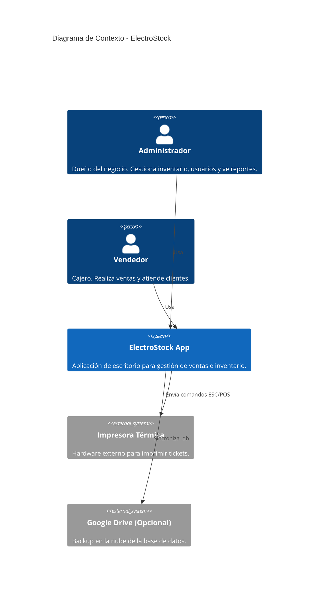
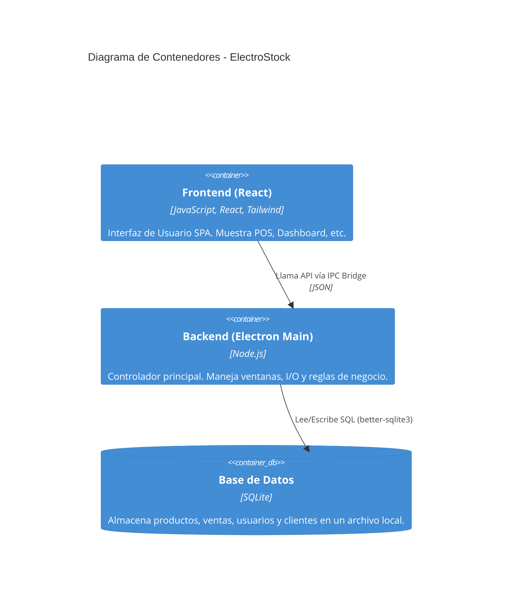
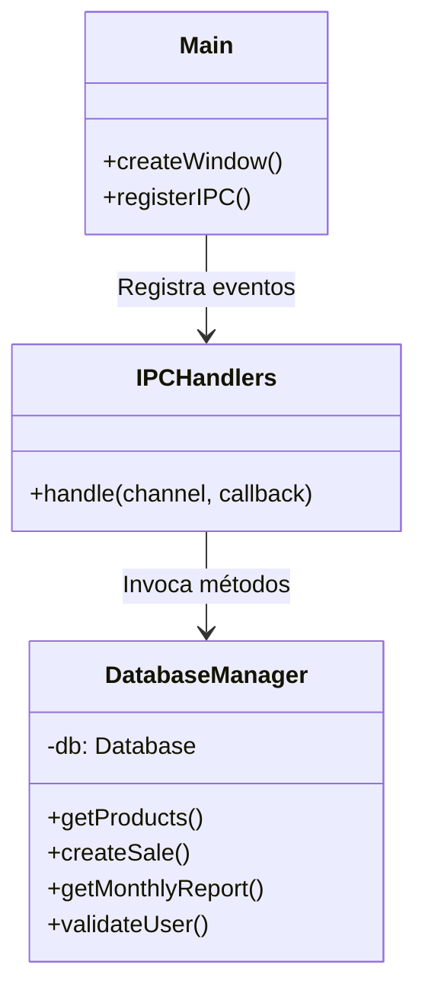

# Documento de Arquitectura de Software (SAD) - ElectroStock

**Versión:** 1.0
**Fecha:** 8 de Diciembre de 2025

## 1. Visión General de la Arquitectura
ElectroStock sigue una arquitectura monolítica de escritorio basada en **Electron**, dividida claramente en dos procesos principales:
1.  **Main Process (Backend):** Maneja la lógica de negocio, acceso a base de datos (SQLite) y sistema operativo.
2.  **Renderer Process (Frontend):** Interfaz de usuario construida con React, encargada de la presentación y la interacción.

El patrón de comunicación es **Asíncrono vía IPC** (Inter-Process Communication), utilizando un puente seguro (`preload.js`) para exponer la API.

## 2. Diagramas C4 (Context, Container, Component)

### 2.1 Nivel 1: Diagrama de Contexto
Muestra cómo el sistema interactúa con el mundo exterior.

### 2.2 Nivel 2: Diagrama de Contenedores
Muestra las aplicaciones y almacenes de datos.

### 2.3 Nivel 3: Diagrama de Componentes (Backend)
Detalle del "Electron Main".

## 3. Patrones Utilizados

### 3.1 Patrones de Diseño
*   **Repository Pattern (Implícito):** La clase `DatabaseManager` actúa como un repositorio, abstrayendo las consultas SQL del resto de la lógica (aunque actualmente está acoplada al Main por simplicidad).
*   **Singleton:** `DatabaseManager` se instancia una sola vez al inicio de la aplicación.
*   **Observer (React):** El Frontend usa el patrón Observer mediante `useState` y `useEffect` para reaccionar a cambios en los datos.

### 3.2 Patrones de Integración
*   **IPC Bridge Pattern:** Se utiliza `contextBridge.exposeInMainWorld` en `preload.js` para exponer una API segura (`window.api`) al Frontend, evitando exponer todo el entorno Node.js (seguridad por diseño).

## 4. Integraciones y APIs
*   **Impresión:** Uso de la API nativa de navegadores `window.print()` con CSS `@media print` para formatear tickets.
*   **Sistema de Archivos:** Acceso mediante módulo `fs` de Node.js (controlado por el Main process) para logs y backups.

## 5. Consideraciones de Seguridad
1.  **Context Isolation:** Habilitado (`contextIsolation: true`) para prevenir ataques XSS que escalen a ejecución de código nativo.
2.  **Hashing de Contraseñas:** Se utiliza el módulo `crypto` con `pbkdf2` o similar para almacenar hashes de contraseñas, nunca texto plano.
3.  **Roles y Permisos:** Validación en Frontend (ocultar menús) Y en Backend (aunque pendiente de reforzar validación estricta por canal IPC).

## 6. Infraestructura
*   **Modelo de Despliegue:** On-Premise (Local).
*   **Requisitos:** PC Windows 10/11 x64.
*   **Actualizaciones:** Manuales (por ahora). Futuro: Electron-Updater.
